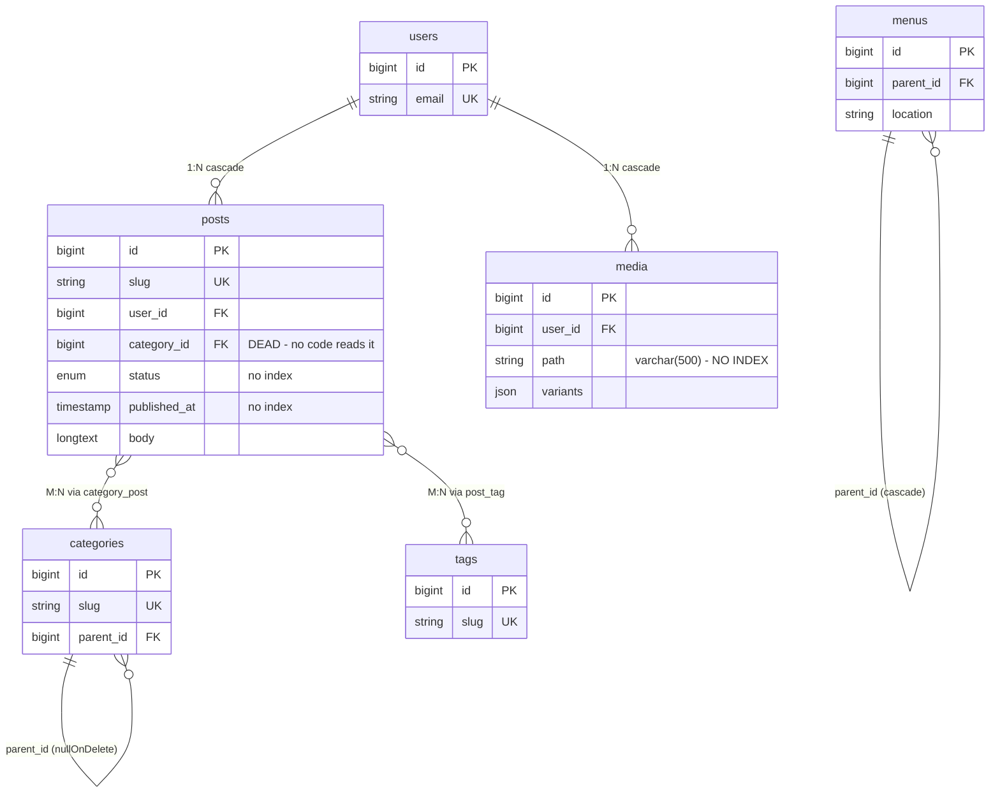

# Database schema & index review

Relation map and performance findings for the webTemplate MySQL schema.

Derived from `database/migrations/` (49 files), `app/Modules/*/Database/Migrations/`,
`app/Models/`, the public controllers, and `database/webtemplate.sql`.

> **Method note.** MySQL was not running when this was compiled, so row counts and live
> `SHOW INDEX` output could not be captured. Index state is inferred from the migrations
> and confirmed against the SQL dump for tables that predate June 2026.

**28 live tables · 7 foreign-key relations · 2 pivot tables · 7 findings · 2 capability gaps**

Includes a [comparison with the WordPress schema](#compared-with-wordpress), read from a
live WordPress 7.1 `wp-admin/includes/schema.php`.

---

## Read this first

The query layer is already in good shape. The public controllers eager-load consistently
(`with(['user:id,name', 'categories:id,name,slug'])`), and `Media::imagePayloadMap()`
batches every featured-image lookup into one `whereIn` instead of the obvious N+1.
**There is no query rewriting to do here.**

What is missing is **indexes** — and the framing matters. At the scale a service-business
site actually runs (a few hundred posts, a few hundred media rows), none of the index gaps
below will be measurable. MySQL scans a 400-row table in well under a millisecond, and the
response cache already sits in front of public pages. These are cheap insurance against
growth, not a speedup you will see on Monday.

Severity labels below are about **growth trajectory**, not today's numbers.

The one finding that genuinely bites over time is **#5, the unbounded growth tables**.
`activity_log` has no pruning and will reach millions of rows on a site with an active
admin. That is the item worth doing regardless of scale.

---

## The relation graph

Seven foreign keys total. Everything hangs off `posts`; almost nothing else in the schema
is related to anything.



Pivot tables (no surrogate key):

| Pivot | Key | Created |
|---|---|---|
| `category_post` | `UNIQUE(category_id, post_id)` | 2026-09-04 |
| `post_tag` | `PRIMARY KEY(post_id, tag_id)` | 2026-05-18 |

### Everything else is an island

These tables have **no foreign keys at all** — flat lists the app reads and writes directly:

`case_studies` · `careers` · `teams` · `testimonials` · `faqs` · `events` · `enquiries` ·
`subscribers` · `site_settings` · `redirects` · `not_found_logs` · `custom_codes` ·
`modules` · `cache_responses`

That is a deliberate consequence of the module system — modules must be independently
toggleable, so cross-module foreign keys would be a liability. It also means there is no
join complexity anywhere to optimise.

---

## Findings

Ranked by what they cost as the site grows, not by ease of fix.

### 1. `media.path` has no index, and every listing page queries it — HIGH

`Media::imagePayloadMap()` resolves featured images with `whereIn('path', …)`, but `path`
is an unindexed `varchar(500)`. Confirmed against the SQL dump: `media` carries only
`PRIMARY KEY (id)` and `KEY media_user_id_foreign (user_id)`. Every blog index, category
archive and post page does a full table scan of `media`.

```php
// app/Models/Media.php:138
self::query()->whereIn('path', array_keys($paths))->get()->keyBy('path');
```

**Fix** — must be raw SQL. Laravel's `Blueprint` has no prefix-index syntax, and a full
index on `varchar(500)` utf8mb4 is 2,000 bytes. `191` matches the convention the existing
migrations already use for old shared-hosting MySQL.

```php
DB::statement('CREATE INDEX media_path_index ON media (path(191))');
```

### 2. No composite index for the hottest query on the site — HIGH

`scopePublished()` filters on `status` and `published_at`, then every caller orders by
`published_at`. Neither column is indexed — `posts` has only `PRIMARY`, `UNIQUE(slug)`,
`KEY(user_id)` and `KEY(category_id)`. That is a scan plus a filesort on the single
most-requested query path in the app.

```php
// app/Models/Post.php:49
->where('status', 'published')
->whereNotNull('published_at')
->where('published_at', '<=', now())

// app/Http/Controllers/Public/BlogController.php:25
->latest('published_at')->paginate(12)
```

**Fix**

```php
$table->index(['status', 'published_at', 'id'], 'posts_status_published_at_id_index');
```

Column order matters: `status` first (equality), `published_at` second (range + sort), `id`
last as the pagination tiebreaker. That last column is borrowed from WordPress — its
`type_status_date` index is `(post_type, post_status, post_date, ID)`, and the trailing `ID`
is what keeps `ORDER BY … DESC, id DESC` fully index-served instead of falling back to a
filesort on ties. See [Compared with WordPress](#compared-with-wordpress).

### 3. Blog search can never use an index — MEDIUM

A leading wildcard makes a B-tree index unusable by definition, so search is always a full
scan of `posts` — including the `longtext body` rows MySQL walks past.

```php
// BlogController.php:22 and :45
->when($request->search, fn ($q, $s) => $q->where('title', 'like', "%{$s}%"))
```

**Fix** — only if search actually gets slow:

```php
DB::statement('CREATE FULLTEXT INDEX posts_search_ft ON posts (title, excerpt)');
// then: ->whereFullText(['title', 'excerpt'], $search)
```

Honestly: leave this until there are thousands of posts. A scan over a few hundred rows
beats the FULLTEXT machinery, and FULLTEXT brings its own quirks (minimum word length,
stopwords).

### 4. Six module tables filter and sort on unindexed columns — WON'T FIX

> **Revised after a closer pass.** This was originally filed as a LOW-priority "add
> `(is_active, sort_order)`". That was wrong, and the indexes should **not** be added.

`case_studies`, `careers`, `teams`, `testimonials`, `faqs` and `events` all follow the same
pattern — `scopeActive()` on `is_active`, then `orderBy('sort_order')` — and none index
either column.

```php
// app/Http/Controllers/Public/CaseStudyController.php:15
CaseStudy::active()->orderBy('sort_order')->get();
```

These tables hold tens of rows. At that size InnoDB table-scans faster than it index-dives,
because an index lookup costs a B-tree descent *plus* a row fetch per match, while the whole
table fits in a page or two. MySQL's optimizer knows this and will ignore the index anyway —
so adding one buys nothing on reads and costs a write on every insert and update.

Two further points that make the index unnecessary even as these grow:

- **`is_active` is near-useless as an index column.** It is boolean, and almost every row is
  `true`. An index whose most common value matches most of the table cannot narrow anything.
- **InnoDB appends the primary key to every secondary index.** So for the widget query
  `where('is_active', true)->latest('id')->limit(N)` in `WidgetDataResolver`, a plain
  `(is_active)` index is already `(is_active, id)` physically — meaning the composite people
  reach for here is usually redundant with what InnoDB gives you for free.

Leave these alone. Revisit only if one of these tables ever passes a few thousand rows.

### 5. Growth tables and their pruning — MOSTLY ALREADY HANDLED

> **Corrected.** This was originally filed as "four tables grow without bound and **nothing
> prunes them**", and called the most important finding in the document. That was wrong —
> it was written without reading `routes/console.php`, which already schedules most of it.

What is actually in place:

| Table | Status |
|---|---|
| `activity_log` | ✅ `activitylog:clean --days=180`, daily at 05:00 |
| `cache_responses` | ✅ Swept daily at 04:30 by the `cache-prune-expired` closure |
| `cache` | ✅ Same closure |
| `failed_jobs` | ✅ `queue:prune-failed --hours=336`, weekly |

So the only genuine gap was **`not_found_logs`** — bots probing `/wp-admin`, `/.env` and
similar fill it steadily on any public site, and nothing in the app ever deleted a row.

**Fixed** — a weekly sweep added to `routes/console.php`:

```php
Schedule::call(static function (): void {
    if (Schema::hasTable('not_found_logs')) {
        DB::table('not_found_logs')
            ->where('last_seen_at', '<', now()->subDays(90))
            ->delete();
    }
})->weekly()->sundays()->at('05:30')->name('not-found-logs-prune');
```

`sessions` is left to Laravel's lottery-based GC, which is probabilistic but adequate — the
table already indexes `last_activity`, and session rows are small.

Two indexes in the migration support this pruning: `not_found_logs(last_seen_at)`, so the
new sweep does not table-scan the table it exists to keep small, and
`activity_log(created_at)`, which makes the *existing* daily clean delete by index instead of
scanning — and separately fixes the filesort on the admin audit listing.

### 6. A dead table and a dead foreign key are still being maintained — LOW

Two leftovers from the September repositioning:

- **The `pages` table.** The `Page` model was deleted and pages now live in
  `data/pages/{slug}.json`. Nothing in `app/` references `Page::` or the table.
- **`posts.category_id`.** Superseded by the `category_post` pivot. It appears only in the
  original migration and the SQL dump — no model relation, no controller, no Vue page reads
  it. But MySQL still maintains its index and validates its FK constraint on every insert
  and update to `posts`.

**Fix**

```php
Schema::dropIfExists('pages');

Schema::table('posts', function (Blueprint $table) {
    $table->dropForeign(['category_id']);
    $table->dropColumn('category_id');
});
```

Check production data before dropping the column — if any client site still has values
there from before the pivot migration, back them up first.

### 7. `database/webtemplate.sql` is three months stale and dangerous — MEDIUM

The checked-in dump is dated 3 June and predates the repositioning entirely. It still
contains `products`, `orders`, `order_items` and `page_metas` — all deliberately dropped —
and is missing `enquiries`, `modules`, `subscribers`, `faqs`, `events`, `testimonials`,
`redirects`, `activity_log`, `cache_responses` and `category_post`.

Anyone who imports it to bootstrap a client site resurrects the ecommerce tables
`CLAUDE.md` explicitly says never to reintroduce.

**Fix** — delete it. `php artisan template:init` already handles first-run setup via
migrate + seed, which is the path the docs point at anyway.

---

## Table inventory

All 28 live tables. `UK` marks a unique constraint.

| Table | Domain | Relations | Index state |
|---|---|---|---|
| `posts` | Blog | → users, ↔ categories, ↔ tags | ⚠️ no status/published_at |
| `categories` | Blog | self (parent_id), ↔ posts | slug UK |
| `tags` | Blog | ↔ posts | slug UK |
| `category_post` | Blog | pivot | unique pair |
| `post_tag` | Blog | pivot | composite PK |
| `media` | Media | → users | ⚠️ no path index |
| `case_studies` | Content | — | ⚠️ is_active/sort_order |
| `careers` | Content | — | ⚠️ is_active/sort_order |
| `teams` | Content | — | ⚠️ is_active/sort_order |
| `testimonials` | Module | — | ⚠️ is_active |
| `faqs` | Module | — | ⚠️ is_active |
| `events` | Module | — | slug UK |
| `modules` | System | — | key UK |
| `menus` | Layout | self (parent_id) | FK indexed |
| `site_settings` | Settings | — | key UK |
| `custom_codes` | System | — | composite |
| `enquiries` | Inbox | — | email, read_at |
| `subscribers` | Inbox | — | email UK |
| `redirects` | SEO | — | from_path UK |
| `not_found_logs` | SEO | — | 📈 unbounded |
| `activity_log` | Audit | morph (subject, causer) | 📈 unbounded |
| `cache_responses` | Cache | — | 📈 unbounded |
| `cache` / `cache_locks` | Cache | — | key PK |
| `users` | Auth | → posts, → media | email UK |
| `sessions` | Auth | → users | 📈 GC is probabilistic |
| permission tables | Auth | spatie morphs | package-managed |
| `jobs` / `failed_jobs` | Queue | — | package-managed |
| `notifications` | System | morph | package-managed |
| `pages` | — | — | ❌ dead — drop |

---

## Compared with WordPress

Source: `wp-admin/includes/schema.php` from a live WordPress 7.1 install — the canonical
definition, read directly rather than from the Codex (which is 403 and frozen anyway).

WordPress creates **12 tables** for a single site. The comparison is worth making because
this project is explicitly "a scaled-down, WordPress-like CMS" — but the schema is the part
of WordPress you should copy least. Most of its shape is a 2003 design plus twenty years of
unbreakable backward compatibility, not a considered model.

### Where this schema is already better

| Axis | WordPress | webTemplate |
|---|---|---|
| Foreign keys | **Zero.** Not one `CONSTRAINT` in the entire schema — MyISAM legacy that the InnoDB migration never fixed. Orphaned `postmeta` after post deletion is a known, permanent source of bloat. | 7 FKs with `cascadeOnDelete` / `nullOnDelete`. The database enforces integrity. |
| Custom fields | EAV: `postmeta`, `usermeta`, `termmeta`, `commentmeta` — all `meta_key varchar(255)` + `meta_value longtext`. | Real typed columns. |
| Taxonomy | 4 tables (`terms`, `termmeta`, `term_taxonomy`, `term_relationships`). "Posts in category X" needs 3 joins. | 2 tables (`categories` + `category_post`). One join. |
| Content types | One `wp_posts` table for posts, pages, attachments, revisions, nav menu items and every CPT, separated by a `post_type` discriminator. | Separate tables, each indexable for its own access pattern. |
| Structured data | `maybe_serialize()` writes PHP-serialized arrays into `longtext`. You cannot query inside them in SQL — at all. | Native `json` columns (`media.variants`, `case_studies.results`, `modules.settings`). |
| Settings reads | `SELECT … WHERE autoload = 'on'` on **every request**. Without an object cache that is a DB round-trip per page load. | `SettingService::all()` is one `Cache::remember('site_settings', 3600)` for the whole table. |

The EAV point deserves emphasis, because it is the single biggest reason WordPress sites get
slow. Note what the meta tables are *not* indexed on:

```sql
CREATE TABLE wp_postmeta (
  meta_id    bigint(20) unsigned NOT NULL auto_increment,
  post_id    bigint(20) unsigned NOT NULL default '0',
  meta_key   varchar(255) default NULL,
  meta_value longtext,
  PRIMARY KEY (meta_id),
  KEY post_id (post_id),
  KEY meta_key (meta_key(191))
);
```

No index on `meta_value`, and no composite `(post_id, meta_key)`. Every `meta_query` — the
thing ACF, WooCommerce and most plugins are built on — is a self-join per field with no
covering index. This schema has no equivalent problem because it has no equivalent table.

### What is genuinely worth stealing

**1. The `type_status_date` index shape.** WordPress's main content index is:

```sql
KEY type_status_date (post_type, post_status, post_date, ID)
```

Discriminator, then status, then date, then `ID` as a tiebreaker. That is finding #2 above,
arrived at independently — and the trailing `ID` is the refinement worth taking. It keeps
`ORDER BY published_at DESC, id DESC` fully served by the index instead of filesorting on
rows that share a timestamp. Finding #2 has been updated accordingly.

**2. The same shape on a second table.** WordPress also indexes
`comment_approved_date_gmt (comment_approved, comment_date_gmt)` — status + date again, for
the comment moderation queue. The `enquiries` inbox here has the identical access pattern
(unread first, newest first) but indexes `email` and `read_at` separately. A composite
`(read_at, created_at)` would serve the actual listing query.

**3. The 191 prefix-index convention — already followed.** WordPress sets
`$max_index_length = 191` with a comment about utf8mb4 and the 767-byte limit, and applies
it to `post_name`, `meta_key`, `slug` and `name`. The migrations here already use the same
191 convention. This validates the `media.path(191)` fix in finding #1.

**4. The `autoload` *concept*, not its implementation.** `wp_options.autoload` separates
"load on every request" from "load on demand" — a good idea. WordPress executes it badly:
the default is `on`, so plugins bloat the autoload set until it reaches megabytes, and core
maintains a hardcoded `$fat_options` list of known offenders to force `off`. The
`site_settings` table here is small and fully cached, so this does not matter today. It
would start to matter if per-client custom settings ever land in that table.

### Two capability gaps — features, not performance

These are things WordPress can do that this schema cannot. Whether they matter is a product
call, not a database one.

**8. No escape hatch for client-specific fields.** WordPress's `postmeta` lets a client add
an arbitrary field with no migration and no deploy. Here, every new field on `posts` needs a
migration — which is the correct tradeoff for a boilerplate, but it does mean per-client
divergence has nowhere to go.

If that becomes a real constraint, copy the *capability* and not the *design*: add a single
`json` column rather than an EAV table.

```php
$table->json('meta')->nullable();   // posts.meta
```

MySQL 8 can index into it with a functional index on just the paths that need querying,
which is the part EAV can never do:

```sql
ALTER TABLE posts ADD INDEX posts_meta_featured ((CAST(meta->>'$.featured' AS UNSIGNED)));
```

One row per post either way, no self-joins, and the flexibility is contained.

**9. No revision history.** WordPress stores revisions as full rows in `wp_posts` with
`post_type = 'revision'`. A post edited 50 times becomes 51 rows in the main content table —
a major reason mature `wp_posts` tables balloon, and a design worth explicitly *not* copying.

The capability is still worth having for a client CMS (writers overwrite each other; clients
ask to roll back). Implement it in a **separate `post_revisions` table** so the hot path
never pays for it, and prune on a schedule the way finding #5 describes.

### What not to copy, in one list

- EAV meta tables — the root cause of most slow WordPress sites
- Zero foreign keys, with integrity enforced only in PHP
- One table for every content type, separated by a discriminator column
- PHP-serialized arrays in `longtext` columns
- Unbounded autoload
- Revisions stored in the main content table

---

## Applied changes

### `2026_09_18_100000_add_performance_indexes.php` — additive, safe on live sites

Index existence is checked against `information_schema` before each statement, so it is safe
to run against client databases in unknown states.

| Index | Serves |
|---|---|
| `media(path(191))` | `Media::imagePayloadMap()` — every public listing page |
| `posts(status, published_at, id)` | `scopePublished()` + `latest('published_at')` |
| `activity_log(created_at)` | Admin audit listing, and the existing daily prune's DELETE |
| `enquiries(read_at, created_at)` | Inbox listing — filter and sort in one index |
| `media(created_at)` | Media library listing (`->latest()`, 24/page) |
| `not_found_logs(last_seen_at)` | The new weekly prune |

**Two indexes dropped.** Removing a useless index is as much an optimisation as adding a
good one — each costs a write on every insert and update:

- `enquiries_email_index` — `email` is only ever queried as `LIKE '%term%'`. A leading
  wildcard makes a B-tree unusable, so this index has **never** been served a single query.
- `enquiries_read_at_index` — now a left-prefix of the new composite, which serves
  everything the standalone one did.

### `2026_09_18_100001_drop_dead_schema_objects.php` — destructive, review before running

Kept as a separate migration deliberately. Drops the dead `pages` table and
`posts.category_id` (finding #6). It **refuses to run** — with a clear error naming the row
count — if any `posts.category_id` value is non-null, so a client site migrated from an
older version cannot silently lose data.

### `routes/console.php`

Added the weekly `not_found_logs` sweep described in finding #5.

---

## Deliberately not done

A DBA's job includes declining changes. Each of these was considered and rejected:

| Change | Why not |
|---|---|
| `(is_active, sort_order)` on the six module tables | Tables hold tens of rows; the optimizer will ignore the index. See revised finding #4. |
| `posts(status, created_at)` for the admin listing | Admin traffic is a handful of editors over 15-row pages. Indexing a cold path is cargo-culting. |
| Reordering `custom_codes(placement, is_active, sort_order)` | The order is wrong for `ORDER BY placement, sort_order` — but the table holds about five rows. |
| `FULLTEXT` on `posts` | Premature. A scan over a few hundred rows beats the FULLTEXT machinery. See finding #3. |
| `TIMESTAMP` → `DATETIME` | Laravel's `timestamps()` uses `TIMESTAMP`, which ends at 2038-01-19. Real, but twelve years out and disruptive to change. Flagged, not touched. |
| `utf8mb4_unicode_ci` → `utf8mb4_0900_ai_ci` | Measurably faster on MySQL 8, but rebuilds every table and index and can shift sort order. This repo explicitly targets old shared hosting where `0900` may not exist. |

## The honest bottom line

The controllers were already doing the right things — consistent eager loading, batched media
lookups, a cached redirect map, a cached settings map. There were no query rewrites to make.

What this pass actually bought you: two hot-path indexes that matter as content grows, two
useless indexes removed, one genuine pruning gap closed, and some dead schema deleted. At
today's row counts you will not see a difference. That is the correct outcome — on a site
this size the database was never what was slow, and the value here is that it stays that way
as client sites age.
